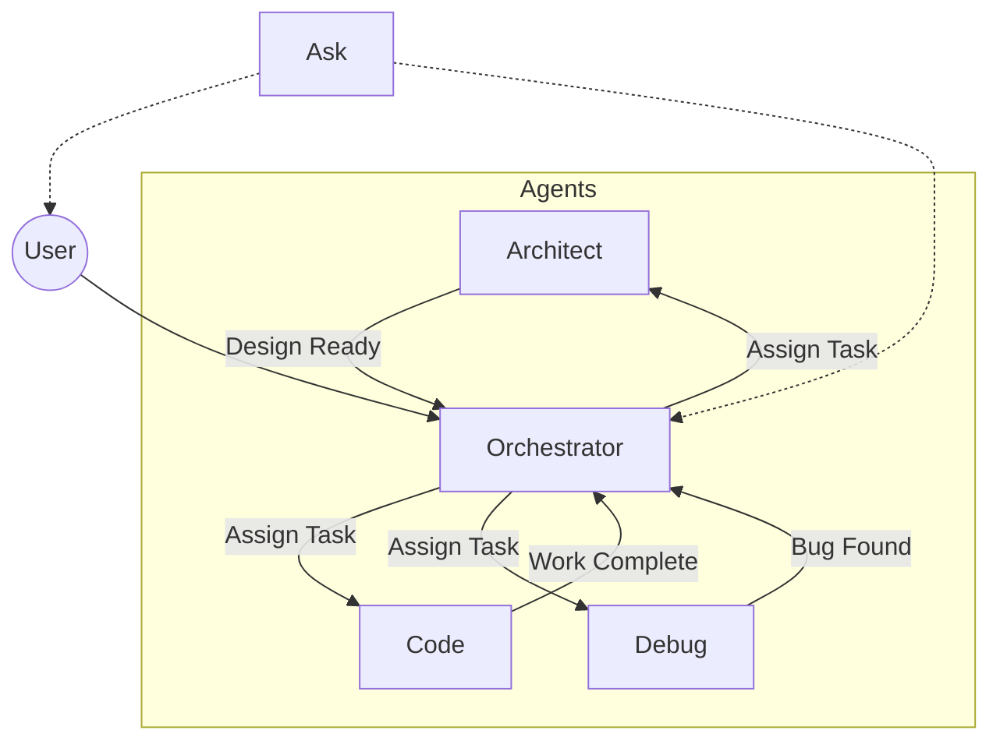

# 🧠 Roo Agentic Collaboration System
**Version**: 1.0  
**Last Updated**: 2025-07-05

This repository implements a structured, file-based agent collaboration model using Roo's native modes. It formalizes how agents share memory, coordinate tasks, and maintain context across sessions and roles.


---

## 📁 Directory Structure

```
[project-name]/
├── pj_directory/             # Application source code & tests
│   ├── src/                  # Production source code
│   ├── tests/                # All test cases and testing logs
│   │   └── tests_log.md      # Shared ledger of test history
│   └── README.md             # Actual project's README FILE
│
├── roo_state/                # Shared memory layer
│   ├── project_state.md      # Source of truth for project goals, status & blockers
│   ├── .roo-config.yaml      # Defines roles, paths, and ownerships
│   └── [Agent]/              # One subfolder per Roo modee (Code, Debug, Architect, etc.)
│       └── mode_log.md       # Append-only YAML ledger for that mode
│
└── SOPFs/                    # All SOPFs (Standard Operating Prompt Footers)
    └── [Mode] SOPF.md        # One per mode
```

---


## 📌 User's Proposed Model

This document captures the coordination and memory structure for agentic development using Roo, aligned with its built-in modes: Orchestrator, Architect, Code, Debug, and Ask.
The aim is to design a scalable and coherent multi-agent setup with clear memory, responsibility, and reporting behaviors.


## 🧱 Central Idea

Each Roo agent operates with both **shared** and **local memory**:

- A **central human-readable `project_state.md`** acts as the single source of truth and high-level project overview.
- Each agent has its own **private memory folder** (e.g., `roo_state/Code/`), where it keeps a `mode_log.md` or equivalent.
- The **Orchestrator owns the `project_state.md`** and updates the central context after each round of execution.


## 🔁 Operational Behavior

1. **Agent Bootstrapping**:
   - Agent reads `roo_state/project_state.md` to understand the global project status.
   - Then reads its own `roo_state/<Mode>/mode_log.md` to resume local role-specific context.

2. **Reconciliation Step**:
   - If `project_state.md` instructions conflict with its prior tasks:
     - Log a justification for the deviation.
     - Update task trajectory accordingly.
     - Reflect new rationale in both central and local memory.

3. **Execution**:
   - Complete the assigned or reconciled task.
   - Log results in:
     - Local `mode_log.md` (full details and assumptions)
     - Orchestrator summary for `project_state.md` (summary and current state)

4. **Cross-Zone Etiquette**:
   - If an agent touches another zone (e.g., Code writes a test), it must:
     - Create a minimal log stub in that zone
     - Annotate origin, purpose, and timestamp

5. **Mutual Awareness**:
   - All agents operate with the expectation of concurrency
   - Communication is written, rationalized, and respectful of shared structure


## 🧭 Boomerang Policy

This project follows a strict coordination protocol:
- ✅ **Only the Orchestrator assigns tasks**
- ✅ **All agents must return results to Orchestrator**
- ❌ Agents must not reassign, redirect, or launch peers
- All handoffs are explicitly declared in logs or `next_step` fields


## 🧠 Active Agent Roles

| Mode        | Responsibility                              |
|-------------|----------------------------------------------|
| Orchestrator| Task assignment, project state manager       |
| Architect   | System design, diagrams, structure planning  |
| Code        | Implements source code & simple tests        |
| Debug       | Investigates bugs, expands test coverage     |
| Ask         | Explains project history & decisions         |


## 🧾 Logging Protocol

Each mode uses an append-only YAML file at `roo_state/[Mode]/mode_log.md`.

**Required Fields:**
- `date`, `task`, `input_from`, `result`, `next_step`, `author`, `hash_id`

**Optional Fields:**
- `details:` (e.g. rationale, affected files, related tests)

**Constraints:**
- Logs must reflect *completed* work — not in-progress thinking
- Only one log entry per atomic task
- `tests_log.md` is shared between Code and Debug for all test tracking


## 🚦 Agent Execution Rules

- All agents must read `roo_state/project_state.md` and their own log before acting
- No agent may edit another's logs or make changes outside its role scope
- All coordination, scheduling, and state changes pass through Orchestrator
- SOPF instructions are binding and must be followed precisely


## 🤝 Cross-Zone Etiquette

| Situation                     | Rule                                                   |
|------------------------------|--------------------------------------------------------|
| One agent creates artifacts  | Must log why, where, and for whom                     |
| Reading peer logs            | Optional, but encouraged for context                  |
| Test artifacts written       | Must be logged to `tests_log.md`                      |
| Orchestrator passes results  | Must summarize outcomes and reason for delegation     |

---


## 🔁 Handoff Flow (Mermaid Diagram)



---

## 📜 Initialization & Launch (See `SETUP.md`)

Before running:
- Rename `[project-name]/` to your actual project
- Populate `.roo-config.yaml` to define mode-path bindings
- Scaffold `project_state.md`, `mode_log.md`, and `tests_log.md` (copy examples)
- Set up each Roo mode using its matching SOPF file
- Start with an initial prompt to Orchestrator ending with:

```text
Begin this project by replacing all template placeholders in `roo_state/project_state.md` with the actual purpose, current active goal, updated task queue, and clarified agents involved. Clean up the example comments if you find them.
```


## 📌 Design Principles

- Explicit memory > token history
- File-based state > ephemeral chat
- Logs behave like Git commits: append-only, scoped, and readable
- Coordinated delegation > implicit multitasking
- Auditability > fragility

This model aims for scalable, auditable, agentic collaboration. Use it as a base for any multi-role, stateful LLM execution system.

--- 

# ⚖️ Open Discussion: Tradeoffs, Risks, and Observations

## ✅ Strengths

- Promotes **accountable autonomy** for each agent
- Enables both human and machine-readable history
- Agents reflect before acting
- Prevents task duplication or contradiction
- Modular, extensible, and readable

## ⚠️ Risks and Overheads

| Issue | Description |
|-------|-------------|
| **Token Bloat** | Reading both central and local logs may reduce available prompt space. |
| **Cognitive Load** | Agents may get lost or underperform if burdened by too much coordination logic. |
| **State Drift** | Logs may become inconsistent if not properly parsed or updated. |
| **Format Fragility** | LLMs might hallucinate, misread, or ignore the logs' structure. |
| **False Confidence** | Illusory continuity may emerge if logs are read but misunderstood. |

## 🧠 Assumptions

- Agents are capable of structured markdown or JSON reasoning.
- Logs are small, summarized, or managed with compression tools.
- `.roo-config.yaml` provides clear and minimal file system metadata.
- Human oversight is present to correct drift or log desync.

## 🧪 Alternative Designs to Consider

- Memory APIs or retrieval-augmented prompt stuffing
- Ephemeral central queues instead of mode logs
- Orchestrator as the sole memory center


