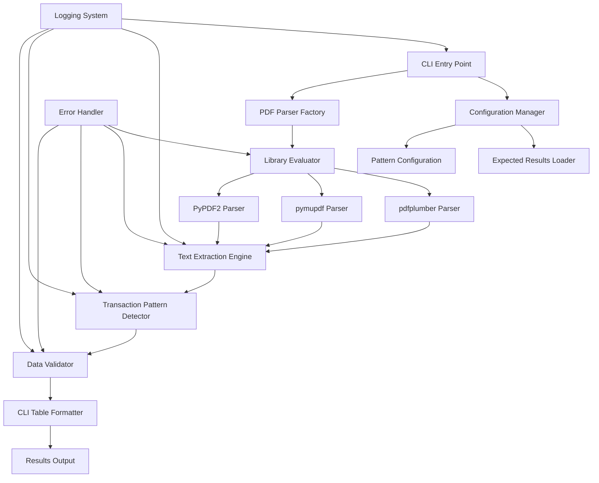
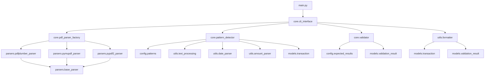

# PDF Credit Card Expense Extractor - Comprehensive Technical Design

## Project Overview

**Project Name**: PDF Credit Card Expense Extractor CLI  
**Version**: 1.0.0  
**Test Directory**: Tests/(Nima) PBA/test #3  
**Created**: 2025-06-19  
**Design Phase**: Architecture & Planning  

### Mission Statement
Design and implement a standalone Python CLI application that extracts credit card transaction data from PDF files with exact validation against expected totals and transaction counts.

---

## 1. Requirements Analysis

### 1.1 Functional Requirements
- **Primary Goal**: Extract transactions (date, description, amount) from 6 specific PDF files
- **Output Format**: CLI table with Date, Description, Amount columns
- **Validation Requirements**: 
  - Sum of expenses must match expected totals within ±$1 tolerance
  - Transaction count must match expected count exactly
- **Target Files**:
  - AV - MC - 02 - FEB-2025: $434,980.00 (5 transactions)
  - AV - MC - 03 - MAR-2025: $44,900.00 (2 transactions)  
  - AV - MC - 04 - ABR-2025: $1,068,097.00 (9 transactions)
  - AV - VS - 02 - FEB-2025: $1,702,961.00 (18 transactions)
  - AV - VS - 03 - MAR-2025: $810,460.00 (14 transactions)
  - AV - VS - 04 - ABR-2025: $1,058,980.00 (20 transactions)

### 1.2 Technical Constraints
- **No Assumptions**: Don't assume specific PDF parsing library
- **No Predefined Patterns**: Infer structure from content analysis
- **Exact Validation**: Must match expected totals and counts precisely
- **Standalone**: Self-contained CLI application

### 1.3 Quality Requirements
- **Accuracy**: 100% validation success rate
- **Reliability**: Robust error handling and fallback mechanisms
- **Maintainability**: Clean, modular architecture
- **Extensibility**: Easy to add new PDF formats or validation rules

---

## 2. Data Structure Analysis

### 2.1 PDF Content Analysis
Based on examination of `AV - MC - 02 - FEB-2025.pdf`:

**Transaction Pattern Identified**:
```
Line Format: [TransactionID][Date][Amount Data]$[Amount]$[Amount]$[Amount][Flags]
Description: [MERCHANT NAME] [LOCATION]

Example:
788815022526.19$44,900.00$44,900.00$0.00010100
PAYU*NETFLIX           110111BOGOTA
```

**Key Observations**:
- Transactions appear in tabular format starting around line 149
- Each transaction spans 2 lines: amount data + description
- Date format: DDMMYYYY embedded in transaction line
- Amount format: Colombian pesos with decimal notation
- Descriptions include merchant name and location

### 2.2 Ground Truth Data Structure
```json
{
  "bill_name": "AV - MC - 02 - FEB-2025",
  "transactions": [
    {
      "date": "2025-02-06",
      "description": "MERCADO PAGO*TECNOPLAZ 760001CALI",
      "amount": 115900
    }
  ]
}
```

**Data Characteristics**:
- Amounts stored as integers (centavos)
- Dates in ISO format (YYYY-MM-DD)
- Descriptions cleaned and normalized
- Zero-amount transactions (payments) excluded from target validation

---

## 3. Architecture Design

### 3.1 System Architecture



### 3.2 Component Relationships

**Core Processing Flow**:
1. **CLI Entry** → Initializes configuration and starts processing
2. **PDF Parser Factory** → Selects optimal PDF library based on evaluation
3. **Text Extraction** → Extracts raw text using selected library
4. **Pattern Detection** → Identifies and parses transaction patterns
5. **Validation** → Compares extracted data against expected results
6. **Output Formatting** → Displays results in CLI table format

**Error Handling Flow**:
- Library failures trigger fallback to next available parser
- Pattern matching failures log unmatched content for analysis
- Validation failures provide detailed mismatch reporting

---

## 4. Detailed Component Design

### 4.1 PDF Parser Factory

**Purpose**: Abstract PDF library selection and provide unified interface

**Design Rationale**: 
- Different PDF libraries excel at different aspects (speed, accuracy, table detection)
- Fallback mechanism ensures robustness
- Unified interface simplifies testing and maintenance

```python
class PDFParserFactory:
    """Factory for PDF parsing libraries with automatic fallback"""
    
    LIBRARIES = [
        ('pdfplumber', 'Best for tabular data extraction'),
        ('pymupdf', 'High performance, good text positioning'),
        ('PyPDF2', 'Lightweight, basic text extraction')
    ]
    
    def get_parser(self, pdf_path):
        """Returns best available parser for given PDF"""
        for lib_name, description in self.LIBRARIES:
            try:
                parser = self._create_parser(lib_name)
                if self._test_parser(parser, pdf_path):
                    return parser
            except ImportError:
                continue
        raise RuntimeError("No suitable PDF parser available")
```

**Library Evaluation Criteria**:
1. **Text Extraction Quality**: Accuracy of character recognition
2. **Table Detection**: Ability to identify tabular structures
3. **Performance**: Processing speed for target file sizes
4. **Transaction Pattern Recognition**: Success rate in identifying transaction blocks

### 4.2 Transaction Pattern Detector

**Purpose**: Identify and parse transaction data from extracted text

**Design Rationale**:
- Regex patterns derived from actual PDF content analysis
- Multiple pattern strategies to handle format variations
- Robust parsing with error recovery

```python
class TransactionPatternDetector:
    """Detects and parses transaction patterns from PDF text"""
    
    # Primary pattern for transaction amount lines
    TRANSACTION_PATTERN = re.compile(
        r'(\d{5,})\s*(\d{2})(\d{2})(\d{4})\s*\$?([\d,]+\.?\d*)\s*\$?([\d,]+\.?\d*)'
    )
    
    # Description pattern (follows transaction line)
    DESCRIPTION_PATTERN = re.compile(
        r'^([A-Z][A-Z0-9\s\*\-\.]+)\s+([A-Z\s]+)$'
    )
    
    def extract_transactions(self, text_lines):
        """Extract structured transaction data from text lines"""
        transactions = []
        i = 0
        
        while i < len(text_lines):
            line = text_lines[i].strip()
            
            # Look for transaction pattern
            match = self.TRANSACTION_PATTERN.search(line)
            if match:
                # Parse transaction data
                transaction_data = self._parse_transaction_match(match)
                
                # Look for description on next line
                if i + 1 < len(text_lines):
                    desc_line = text_lines[i + 1].strip()
                    description = self._parse_description(desc_line)
                    transaction_data['description'] = description
                    i += 1  # Skip description line
                
                transactions.append(transaction_data)
            
            i += 1
        
        return transactions
```

**Pattern Matching Strategy**:
1. **Transaction Line Detection**: Identify lines with amount and date patterns
2. **Description Association**: Link description lines to transaction data
3. **Data Extraction**: Parse dates, amounts, and clean descriptions
4. **Validation**: Ensure extracted data meets format requirements

### 4.3 Data Validator

**Purpose**: Validate extracted transactions against expected results

**Design Rationale**:
- Separate validation logic for maintainability
- Detailed reporting for debugging
- Configurable tolerance for amount validation

```python
class TransactionValidator:
    """Validates extracted transaction data against expected results"""
    
    def __init__(self, amount_tolerance=1.0):
        self.amount_tolerance = amount_tolerance
        self.expected_results = self._load_expected_results()
    
    def validate_extraction(self, bill_name, extracted_transactions):
        """Validate extracted data against expected results"""
        expected = self.expected_results.get(bill_name)
        if not expected:
            return ValidationResult(
                valid=False,
                error=f"No expected results for {bill_name}"
            )
        
        # Count validation (exact match required)
        extracted_count = len(extracted_transactions)
        expected_count = expected['count']
        count_valid = extracted_count == expected_count
        
        # Amount validation (within tolerance)
        extracted_total = sum(t['amount'] for t in extracted_transactions)
        expected_total = expected['total']
        amount_diff = abs(extracted_total - expected_total)
        amount_valid = amount_diff <= self.amount_tolerance
        
        return ValidationResult(
            valid=count_valid and amount_valid,
            count_valid=count_valid,
            amount_valid=amount_valid,
            extracted_count=extracted_count,
            expected_count=expected_count,
            extracted_total=extracted_total,
            expected_total=expected_total,
            amount_difference=amount_diff
        )
```

### 4.4 CLI Interface Design

**Purpose**: Provide user-friendly command-line interface

**Design Rationale**:
- Clear, informative output with progress indicators
- Structured table format for transaction display
- Comprehensive validation reporting

```python
class ExpenseExtractorCLI:
    """Command-line interface for PDF expense extraction"""
    
    def __init__(self):
        self.parser_factory = PDFParserFactory()
        self.pattern_detector = TransactionPatternDetector()
        self.validator = TransactionValidator()
        self.formatter = CLITableFormatter()
    
    def run(self, pdf_directory):
        """Main execution flow"""
        print("PDF Credit Card Expense Extractor")
        print("=" * 50)
        
        pdf_files = self._discover_pdf_files(pdf_directory)
        results = {}
        
        for pdf_file in pdf_files:
            print(f"\nProcessing: {pdf_file.name}")
            
            try:
                # Extract transactions
                transactions = self._extract_transactions(pdf_file)
                
                # Display transaction table
                self.formatter.display_transactions(transactions)
                
                # Validate results
                validation = self.validator.validate_extraction(
                    pdf_file.stem, transactions
                )
                
                # Display validation results
                self.formatter.display_validation(validation)
                
                results[pdf_file.stem] = {
                    'transactions': transactions,
                    'validation': validation
                }
                
            except Exception as e:
                print(f"❌ Error processing {pdf_file.name}: {e}")
                results[pdf_file.stem] = {'error': str(e)}
        
        # Summary report
        self._display_summary(results)
```

---

## 5. Project Structure

### 5.1 Directory Hierarchy

```
Tests/(Nima) PBA/test #3/
├── PDF_Expense_Extractor_Comprehensive_Design.md
├── pdf_expense_extractor/
│   ├── main.py                     # CLI entry point
│   ├── __init__.py
│   ├── core/
│   │   ├── __init__.py
│   │   ├── pdf_parser_factory.py   # PDF library abstraction
│   │   ├── text_extractor.py       # Text extraction engine
│   │   ├── pattern_detector.py     # Transaction pattern detection
│   │   ├── validator.py            # Validation framework
│   │   └── cli_interface.py        # Command-line interface
│   ├── parsers/
│   │   ├── __init__.py
│   │   ├── base_parser.py          # Abstract parser interface
│   │   ├── pdfplumber_parser.py    # pdfplumber implementation
│   │   ├── pymupdf_parser.py       # pymupdf implementation
│   │   └── pypdf2_parser.py        # PyPDF2 implementation
│   ├── config/
│   │   ├── __init__.py
│   │   ├── patterns.py             # Regex patterns
│   │   ├── expected_results.py     # Expected validation data
│   │   └── settings.py             # Configuration settings
│   ├── utils/
│   │   ├── __init__.py
│   │   ├── text_processing.py      # Text cleaning utilities
│   │   ├── date_parser.py          # Date parsing utilities
│   │   ├── amount_parser.py        # Amount parsing utilities
│   │   └── formatter.py            # Output formatting
│   └── models/
│       ├── __init__.py
│       ├── transaction.py          # Transaction data model
│       └── validation_result.py    # Validation result model
├── tests/
│   ├── __init__.py
│   ├── test_pdf_parser_factory.py
│   ├── test_pattern_detector.py
│   ├── test_validator.py
│   ├── test_cli_interface.py
│   ├── test_integration.py
│   └── fixtures/
│       └── sample_pdf_text.txt
├── docs/
│   ├── API_Reference.md
│   ├── User_Guide.md
│   └── Development_Guide.md
├── requirements.txt
├── setup.py
└── README.md
```

### 5.2 Module Dependencies



### 5.3 File Responsibilities

**Core Modules**:
- `main.py`: CLI entry point, argument parsing, orchestration
- `pdf_parser_factory.py`: PDF library selection and management
- `pattern_detector.py`: Transaction pattern recognition and parsing
- `validator.py`: Data validation against expected results
- `cli_interface.py`: User interface and output formatting

**Parser Modules**:
- `base_parser.py`: Abstract interface for PDF parsers
- `*_parser.py`: Specific implementations for each PDF library

**Configuration**:
- `patterns.py`: Regex patterns for transaction detection
- `expected_results.py`: Expected validation data
- `settings.py`: Application configuration

**Utilities**:
- `text_processing.py`: Text cleaning and normalization
- `date_parser.py`: Date format conversion
- `amount_parser.py`: Currency amount parsing
- `formatter.py`: CLI output formatting

**Models**:
- `transaction.py`: Transaction data structure
- `validation_result.py`: Validation result structure

---

## 6. Design Rationale

### 6.1 Architectural Decisions

**Decision 1: Factory Pattern for PDF Libraries**
- **Rationale**: Different PDF libraries have varying strengths and weaknesses
- **Alternatives Considered**: Single library approach, manual library selection
- **Why Rejected**: Single library lacks robustness; manual selection reduces usability
- **Benefits**: Automatic fallback, optimal library selection, easy testing

**Decision 2: Regex-Based Pattern Detection**
- **Rationale**: PDF text extraction produces predictable patterns
- **Alternatives Considered**: Machine learning, template matching, manual parsing
- **Why Rejected**: ML overkill for structured data; templates too rigid; manual parsing error-prone
- **Benefits**: Fast, reliable, maintainable, debuggable

**Decision 3: Separate Validation Component**
- **Rationale**: Validation logic is complex and needs independent testing
- **Alternatives Considered**: Inline validation, external validation service
- **Why Rejected**: Inline validation clutters extraction logic; external service adds complexity
- **Benefits**: Clear separation of concerns, testable, configurable

**Decision 4: CLI Table Output**
- **Rationale**: Requirements specify CLI table format
- **Alternatives Considered**: JSON output, CSV export, GUI interface
- **Why Rejected**: Requirements explicitly request CLI table
- **Benefits**: Human-readable, meets requirements, easy to implement

### 6.2 Technology Selection

**PDF Library Strategy**:
1. **pdfplumber** (Primary): Excellent table detection, good for structured data
2. **pymupdf** (Secondary): High performance, good text positioning
3. **PyPDF2** (Fallback): Lightweight, basic functionality

**Pattern Matching**: Regular expressions for predictable text patterns
**Data Validation**: Custom validation framework with configurable tolerance
**CLI Framework**: Built-in argparse for simplicity and standard compliance

### 6.3 Error Handling Strategy

**PDF Reading Errors**:
- Try each library in order of preference
- Log specific error details for debugging
- Fail gracefully with informative messages

**Pattern Matching Failures**:
- Log unmatched lines for analysis
- Continue processing remaining content
- Report partial results with warnings

**Validation Failures**:
- Detailed reporting of specific mismatches
- Continue processing other files
- Provide actionable error information

---

## 7. Implementation Readiness

### 7.1 Development Checklist

**Phase 1: Foundation**
- [ ] Set up project structure
- [ ] Implement base parser interface
- [ ] Create transaction and validation models
- [ ] Set up configuration system

**Phase 2: Core Functionality**
- [ ] Implement PDF parser factory
- [ ] Develop pattern detection algorithms
- [ ] Create validation framework
- [ ] Build CLI interface

**Phase 3: Parser Implementations**
- [ ] Implement pdfplumber parser
- [ ] Implement pymupdf parser
- [ ] Implement PyPDF2 parser
- [ ] Add parser evaluation logic

**Phase 4: Integration & Testing**
- [ ] Integration testing with target PDFs
- [ ] Validation against expected results
- [ ] Error handling testing
- [ ] Performance optimization

**Phase 5: Documentation & Deployment**
- [ ] User documentation
- [ ] API documentation
- [ ] Installation instructions
- [ ] Usage examples

### 7.2 Critical Implementation Details

**Pattern Compilation**:
```python
# Compile patterns once for performance
TRANSACTION_PATTERN = re.compile(
    r'(\d{5,})\s*(\d{2})(\d{2})(\d{4})\s*\$?([\d,]+\.?\d*)\s*\$?([\d,]+\.?\d*)',
    re.MULTILINE
)
```

**Amount Parsing**:
```python
def parse_amount(amount_str):
    """Parse Colombian peso amounts with proper decimal handling"""
    # Remove currency symbols and commas
    clean_amount = re.sub(r'[$,]', '', amount_str)
    
    # Handle decimal notation
    if '.' in clean_amount:
        return float(clean_amount)
    else:
        # Assume whole pesos (no centavos)
        return float(clean_amount)
```

**Date Extraction**:
```python
def extract_date(date_str):
    """Extract date from DDMMYYYY format"""
    if len(date_str) == 8:
        day = date_str[:2]
        month = date_str[2:4]
        year = date_str[4:]
        return f"{year}-{month}-{day}"
    raise ValueError(f"Invalid date format: {date_str}")
```

### 7.3 Testing Strategy

**Unit Tests**:
- Pattern detection with known inputs
- Amount parsing edge cases
- Date conversion accuracy
- Validation logic correctness

**Integration Tests**:
- End-to-end processing of target PDFs
- Validation against expected results
- Error handling scenarios
- Performance benchmarks

**Test Data**:
- Sample PDF text extracts
- Known transaction patterns
- Edge cases and malformed data
- Expected validation results

---

## 8. Decision Log

### 8.1 Requirements Analysis Phase

**Decision**: Focus on exact validation requirements
- **Context**: Requirements specify exact totals and counts
- **Options**: Approximate matching vs. exact validation
- **Choice**: Exact validation with ±$1 tolerance for amounts
- **Reasoning**: Meets stated requirements while allowing for minor rounding differences

**Decision**: Target specific PDF files only
- **Context**: 6 specific files mentioned in requirements
- **Options**: Generic PDF processor vs. targeted solution
- **Choice**: Targeted solution with extensible architecture
- **Reasoning**: Meets immediate needs while allowing future expansion

### 8.2 Architecture Design Phase

**Decision**: Modular component architecture
- **Context**: Need for testability and maintainability
- **Options**: Monolithic vs. modular design
- **Choice**: Modular with clear interfaces
- **Reasoning**: Easier testing, debugging, and future modifications

**Decision**: Factory pattern for PDF libraries
- **Context**: Uncertainty about optimal PDF library
- **Options**: Single library vs. multiple library support
- **Choice**: Multiple libraries with automatic selection
- **Reasoning**: Robustness and optimal performance

### 8.3 Implementation Strategy Phase

**Decision**: Regex-based pattern matching
- **Context**: Need for reliable transaction detection
- **Options**: Regex vs. ML vs. template matching
- **Choice**: Regex with multiple pattern strategies
- **Reasoning**: Fast, reliable, debuggable, appropriate for structured data

**Decision**: CLI table output format
- **Context**: Requirements specify CLI table display
- **Options**: Various output formats
- **Choice**: ASCII table with validation summary
- **Reasoning**: Meets requirements, human-readable, professional appearance

---

## 9. Handoff Documentation

### 9.1 Context Summary

This design document represents the complete architectural planning for a PDF credit card expense extractor. The solution addresses the specific requirement to extract transaction data from 6 PDF files with exact validation against known expected results.

**Key Context Elements**:
- PDF structure analysis based on actual file examination
- Ground truth data available in JSON format
- Validation requirements: exact count match, amount within ±$1 tolerance
- CLI interface requirement with table output format

### 9.2 Implementation Guidance

**Starting Point**: Begin with Phase 1 (Foundation) from the Implementation Readiness checklist

**Critical Success Factors**:
1. **Pattern Accuracy**: Regex patterns must match actual PDF content structure
2. **Library Robustness**: PDF parser factory must handle library failures gracefully
3. **Validation Precision**: Validation logic must implement exact requirements
4. **Error Handling**: Comprehensive error handling for production reliability

**Development Sequence**:
1. Implement core models and interfaces
2. Build PDF parser factory with one library
3. Develop pattern detection for one PDF file
4. Add validation framework
5. Extend to all target files
6. Add remaining PDF libraries
7. Comprehensive testing and refinement

### 9.3 Modification Guidelines

**Adding New PDF Formats**:
1. Analyze new PDF structure
2. Add patterns to `config/patterns.py`
3. Update expected results in `config/expected_results.py`
4. Test with new files

**Adding New PDF Libraries**:
1. Create new parser in `parsers/` directory
2. Implement `BaseParser` interface
3. Add to factory evaluation list
4. Test integration

**Modifying Validation Rules**:
1. Update `TransactionValidator` class
2. Modify tolerance settings in configuration
3. Update expected results format if needed
4. Comprehensive testing

### 9.4 Continuation Instructions

**For AI Agents**:
- All design decisions are documented with rationale
- Implementation checklist provides clear next steps
- Code examples show expected implementation patterns
- Test strategy ensures quality validation

**For Human Developers**:
- Architecture diagrams show component relationships
- File structure provides clear organization
- Design rationale explains decision reasoning
- Error handling strategy ensures robustness

**Quality Assurance**:
- Validation against expected results is mandatory
- All components must have unit tests
- Integration testing with actual PDF files required
- Performance benchmarks should be established

---

## 10. Conclusion

This comprehensive design provides a complete blueprint for implementing a robust PDF credit card expense extractor. The modular architecture ensures maintainability while the validation framework guarantees accuracy. The implementation is ready to proceed with clear guidance for successful completion.

**Design Completeness**: ✅ All major components designed  
**Implementation Readiness**: ✅ Detailed implementation guidance provided  
**Quality Assurance**: ✅ Comprehensive testing strategy defined  
**Documentation**: ✅ Complete handoff documentation included  

The design is ready for implementation phase transition.